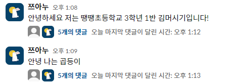
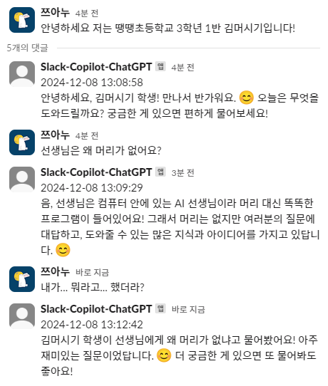
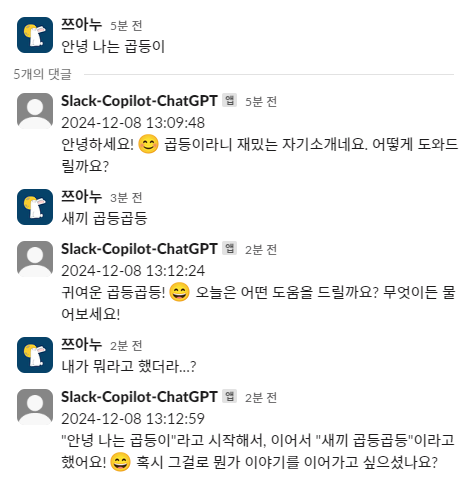

# ChatGPT-Wrapper
- now version : 1.1
- v1.1 : api, model-change
- v1 : text-only, window-only, slack-bot, no-api, gpt-4o-only

## TODO
- [ ] git 설치
- [ ] poetry 환경변수 추가하기
- [ ] 

## Background
- 업무나 업무 외적으로도 GPT를 사용하는 비중이 커졌으나, 따로 관리하는 방법이 없고 날짜별로 정리만 해주기 때문에 이전에 질문했던 내용을 찾기가 쉽지 않습니다.
- 그러다 Slack이나 디스코드의 채널을 떠올렸는데, 관련 업무에 대한 질문을 해당 채널에서 관리할 수 있다면 조금 더 접근이 용이해지지 않을까 했습니다.

## Functions
- slack 봇 형태로 동작합니다.
- 채널에 질문이 들어오면 해당 질문에 대한 쓰레드로 gpt가 생성한 답변을 반환합니다.
- 해당 쓰레드에서 질문을 이어나갈 수 있습니다.
- API 대신 구독중인 본인의 chatgpt 계정을 활용하고 있으므로 해당 프로젝트는 반드시 **상업적 목적으로 사용해선 안됩니다**.
- chatgpt [docs](https://platform.openai.com/docs/api-reference/chat/create)에 나와있는 것과 동일하게 `v1/chat/completions` endpoint를 본인의 것에 붙여 api를 사용할 수 있습니다. (분산처리 구현 X)

## Example
- 쓰레드로 채팅을 관리하는 예제, 각 채팅이 독립적으로 동작합니다.
  
  - 첫 번째 쓰레드
    
  - 두 번째 쓰레드
    

- API를 활용해 답변을 생성하는 예제
  - CMD
    ```
    curl https://{address}/v1/chat/completions \
    -H "Content-Type: application/json" \
    -d '{
      "model": "gpt-4o",
      "messages": [
        {
          "role": "system",
          "content": "You are a helpful assistant. 한국어로 답해줘."
        },
        {
          "role": "user",
          "content": "내가 제일 좋아하는 과일이 뭘까?"
        }
      ]
    }'
    ```
  - 결과
    

## Inference
#### 1. `install.bat` 를 실행하여 poetry 설치 및 필요한 패키지 설치
  - `python==3.10.11`을 권장
  - `pyenv` 설치 코드도 `install.bat`에 있으니 필요시 주석해제하여 실행
#### 2. Slack 봇 생성, 초대
  - (이미 한 번 했으면 생략) slack api 페이지([링크](https://api.slack.com/apps))에서 봇 생성 및 봇을 추가할 워크스페이스 선택
    - OAuth & Permissions 들어가서 Scopes에 `channels:history`, `chat:write`, `chat:write.public` 추가
    - OAuth Tokens 만든 후 `Bot User OAuth Token` 복사 및 `app/slack/bot.py`의 `SLACK_BOT_TOKEN`에 붙여넣기
  - 워크스페이스에서 원하는 채널에 들어가 `/invite @bot-name` 명령어를 통해 봇 초대
#### 3. Slack 봇 Handling 및 chatgpt 스크래핑을 담당하는 로컬 웹서버 배포
  - `poetry run uvicorn app.main:app --host 0.0.0.0 --port 8000`
  - (중요!) 띄워진 chrome 창에서 chatgpt 페이지에 들어가 로그인 한 번 진행하기
#### 4. ngrok을 활용해 로컬 서버를 공개 서버로 배포
  - ngrok 설치([링크](https://download.ngrok.com/windows))
  - 로컬 서버 -> 공개 서버, `ngrok http http://localhost.8000`
  - 공개 서버 주소 복사
#### 5. Slack 채팅 이벤트 핸들링
  - Slack 봇이 있는 채널에서 발생하는 이벤트를 감지하기 위해 앞서 만들어준 봇 페이지에 접속하여([관련 링크](https://api.slack.com/apps))에서 Event Subscription 페이지로 이동
  - Enable Events 토글 on 해주고 Request URL에 앞서 복사한 공개서버 주소 붙여넣기
    - `{공개서버주소}/slack/events`
    - Subscribe to bot events를 눌러 `message.channels` 이벤트 추가
#### 6. 🚀 완료, 이제 slack 봇이 들어있는 채팅창에서 채팅을 시작하세요.

#### Extra. API 사용하기
```
curl https://{address}/v1/chat/completions \
-H "Content-Type: application/json" \
-d '{
  "model": "gpt-4o",
  "messages": [
    {
      "role": "system",
      "content": "{system 프롬프트를 입력합니다.}"
    },
    {
      "role": "user",
      "content": "{질문을 구성합니다.}"
    }
  ]
}'
```

